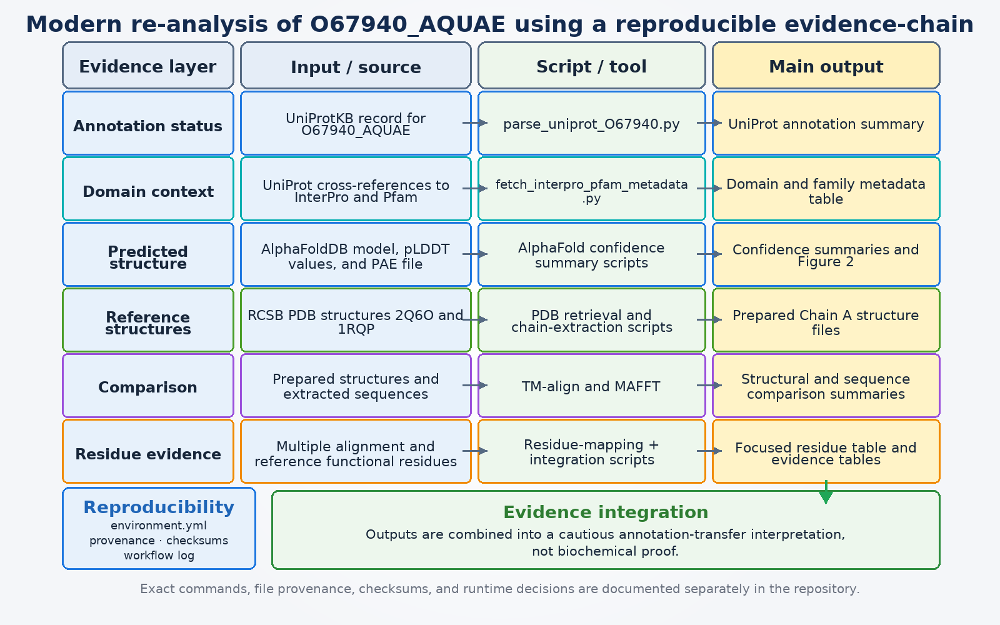

# Revisiting O67940_AQUAE: a reproducible evidence-chain for structure-guided protein function inference

A modern re-analysis of a published protein-function prediction workflow, focused on annotation transfer, structural evidence, residue mapping, and transparent reproducibility.

## Workflow overview



**Figure 1.** Reproducible evidence-chain workflow for the modern re-analysis of O67940_AQUAE.

## Project title

**A reproducible modern re-analysis of a structure-guided protein function inference workflow**

## Case-study protein

* **Protein:** O67940_AQUAE
* **UniProt accession:** O67940
* **Organism:** *Aquifex aeolicus* strain VF5
* **Original article:** Mazumder and Vasudevan (2008), *Structure-Guided Comparative Analysis of Proteins: Principles, Tools, and Applications for Predicting Function*

## Short summary

This repository contains a modern re-analysis of selected parts of a published protein function prediction workflow.

The original paper used O67940_AQUAE as a case study to show how sequence similarity, domain/family information, structural comparison, phylogenetic context, and functional-residue mapping can be combined to infer the possible function of an uncharacterized protein.

In this project, I revisit that case study using current resources and a more reproducible computational workflow. The aim is not to claim a perfect historical reproduction. Instead, the project documents what could be reproduced, what had to be modernized, what failed, what needed correction, and what biological interpretation still remains reasonable.

## Project framing

This is **not** a complete reproduction of the original ten-step workflow.

It is better understood as:

> a reproducible modern re-analysis and audit of selected evidence from a published structure-guided protein function inference workflow.

The project focuses on:

* partial reproduction of key evidence layers;
* use of updated databases and structural resources;
* clear provenance tracking;
* scripted and reproducible analysis where possible;
* careful residue/function mapping;
* honest documentation of failed or limited steps;
* cautious biological interpretation.

## Biological question

The original paper discussed whether O67940_AQUAE should be interpreted as:

* a chlorinase-like enzyme;
* a fluorinase-like enzyme;
* or a broader SAM-dependent halogenase-related protein.

Because the sequence identity to characterized reference proteins was low, the original authors argued that direct functional annotation transfer would be risky without additional evidence.

This re-analysis asks a focused question:

> Do current sequence, domain, structural, and residue-mapping evidence still support the original cautious interpretation?

## Main workflow

The workflow used here follows this evidence chain:

1. Retrieve the current UniProtKB record for O67940_AQUAE.
2. Parse the current annotation status and database cross-references.
3. Retrieve InterPro/Pfam domain metadata.
4. Retrieve and assess the AlphaFoldDB predicted structure.
5. Retrieve reference PDB structures 2Q6O and 1RQP.
6. Extract representative chain A sequences and structures.
7. Attempt structural comparison using TM-align.
8. Align sequences using MAFFT.
9. Map functional residues discussed in the original paper.
10. Integrate the evidence into a final interpretation, including limitations.

Some original workflow steps could not be reproduced exactly because of changes in databases, unavailable parameters, and software/runtime issues. These issues are documented rather than hidden, because they are part of the reproducibility story.

## Repository structure

```text
methods_bioinfo_reanalysis/
├── data/                  # Raw downloaded input files and database records
├── scripts/               # Reusable analysis scripts
├── results/               # Processed outputs and summary tables
├── figures/               # Report-ready figures
├── notes/                 # Interpretation notes and workflow decisions
├── metadata/              # Provenance tables, checksums, and file inventory
├── report/                # Report draft sections and planning files
├── environment.yml        # Conda environment export
├── README.md              # Project overview
└── .gitignore
```

## Reproducibility and auditability

In this project I treat reproducibility as part of the result, not just as an appendix.

The workflow keeps track of:

* where the input data came from;
* source URLs(downloaded database records) and access dates;
* checksums for key files;
* software environment and tool versions;
* intermediate outputs;
* runtime failures, failed steps and fixes;
* scripts used to generate outputs;
* interpretation notes explaining important decisions.

The goal is not only to obtain results, but also to make the path toward those results visible.

Key reproducibility files:

```text
REPRODUCIBILITY.md
environment.yml
metadata/source_provenance.tsv
metadata/checksums_sha256.txt
metadata/current_project_file_inventory.txt
notes/workflow_log.md
notes/reproducibility_audit_note.md
```

For detailed reproduction instructions, see:

```text
REPRODUCIBILITY.md
```

That file explains how to rerun the workflow from the included data, which steps were manual or semi-manual, and where runtime corrections are documented.

---

## Key outputs

| Evidence layer | Main output | What it shows |
|---|---|---|
| Current annotation status | `results/uniprot_O67940_record_summary.txt` | O67940_AQUAE remains an unreviewed UniProtKB/TrEMBL entry annotated as an “Uncharacterized protein”, with no parsed UniProt FUNCTION comment, GO annotation, or PDB cross-reference. |
| Domain/family evidence | `results/O67940_interpro_pfam_metadata.tsv` | Current InterPro/Pfam evidence links O67940_AQUAE to SAM_HAT N-terminal/C-terminal domains and a SAM-related family context. |
| AlphaFold confidence | `results/alphafold/O67940_alphafold_plddt_summary.txt` | The AlphaFoldDB v6 model has high local confidence, supporting structural inspection but not proving biochemical function. |
| AlphaFold domain-level uncertainty | `results/alphafold/O67940_alphafold_pae_by_domain_summary.txt` | Domain-level PAE values support a coherent predicted structural model, while still requiring cautious interpretation. |
| Structural comparison | `results/structure_comparison/tmalign_pairwise_summary.tsv` | TM-align shows strong global fold similarity between O67940_AQUAE and both reference enzymes, with stronger reference-normalized similarity to 2Q6O than to 1RQP. |
| Sequence alignment | `results/sequence_alignment/O67940_2Q6O_1RQP_alignment_summary.tsv` | MAFFT shows nearly equal global sequence identity to both reference structures, so sequence identity alone does not resolve specificity. |
| Functional-residue mapping | `results/residue_mapping/focused_functional_residue_summary.tsv` | Focused mapping reproduces the key O67940_AQUAE positions Val67 and Gly127. Gly127 aligns with 2Q6O Gly131 rather than 1RQP Ser158. |
| Evidence integration | `results/evidence_integration/evidence_integration_table_short.tsv` | Summarizes what each evidence layer supports, what it does not prove, and what limitation remains. |

### Report figures

| Figure | File | Purpose |
|---|---|---|
| AlphaFold confidence profile | `figures/report/figure2_alphafold_plddt_by_residue.png` | Visualizes residue-level pLDDT confidence across O67940_AQUAE. |
| Structural similarity summary | `figures/report/figure3_tmalign_structural_similarity.png` | Summarizes TM-align structural comparison across the three structures. |
| Focused residue mapping | `figures/report/figure4_focused_residue_mapping.png` | Visual support for the two specificity-related aligned residue sites. |

## Reproduced, modernized, and not reproduced

A detailed scope note is available here:

```text
report/planning/reproduction_modernization_scope_matrix.md
```

| Category             | Examples                                                                                                                                                    |
| -------------------- | ----------------------------------------------------------------------------------------------------------------------------------------------------------- |
| Reproduced           | O67940_AQUAE case study; use of 2Q6O and 1RQP; key Val67/Gly127 residue-mapping logic                                                                       |
| Modernized           | Current UniProt/InterPro/Pfam retrieval; AlphaFoldDB model analysis; TM-align; scripted reproducibility; checksums and provenance                           |
| Not fully reproduced | Full PSI-BLAST/nr workflow; PIRSF/COG/PROSITE scans; SCOP/VAST workflow; broad homolog extraction; full phylogenetic reconstruction; biochemical validation |

---

## Figures

Report-ready figures are available in:

```text
figures/report/
```

Current figures:

```text
figure1_workflow_evidence_chain.png
figure2_alphafold_plddt_by_residue.png
figure3_tmalign_structural_similarity.png
figure4_focused_residue_mapping.png
```


## Main conclusion

The integrated computational evidence supports that O67940_AQUAE belongs to a SAM-dependent halogenase-related functional context.

The modern structural and residue-mapping evidence leans closer to the chlorinase-related reference **2Q6O** than to a direct fluorinase-specific assignment.

But this remains a computational inference. The workflow does not experimentally prove enzyme activity or exact substrate specificity. Annotation transfer is useful, but it remains an inference, especially when sequence identity is low or key functional residues differ.

## Important limitations

This project does not claim experimental biochemical validation

Main limitations include:

* the original workflow could not be reproduced perfectly(not every tool or database);
* does not include full homolog phylogenetic reconstruction;
* some databases and tools have changed since the original paper;
* AlphaFold provides a predicted structure, not an experimentally solved structure;
* structural similarity does not automatically prove identical function;
* residue mapping supports hypotheses but does not prove catalytic activity;
* annotation transfer remains uncertain when sequence identity is low;
* some runtime failures, including TM-align execution problems, had to be documented as reproducibility limitations.
* Some C-terminal 2Q6O positions showed current PDB numbering or construct discrepancies, so those are reported cautiously instead of forced into a perfect match.


## Why this project matters

For me, this project is not just about one protein.

It is also about learning how to handle a real computational biology workflow in a more serious way: checking provenance, documenting failures, separating evidence from interpretation, and avoiding overclaims when inferring protein function.

