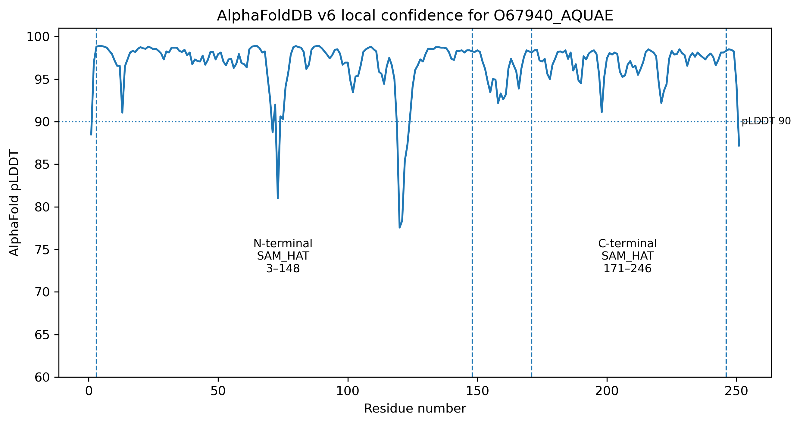
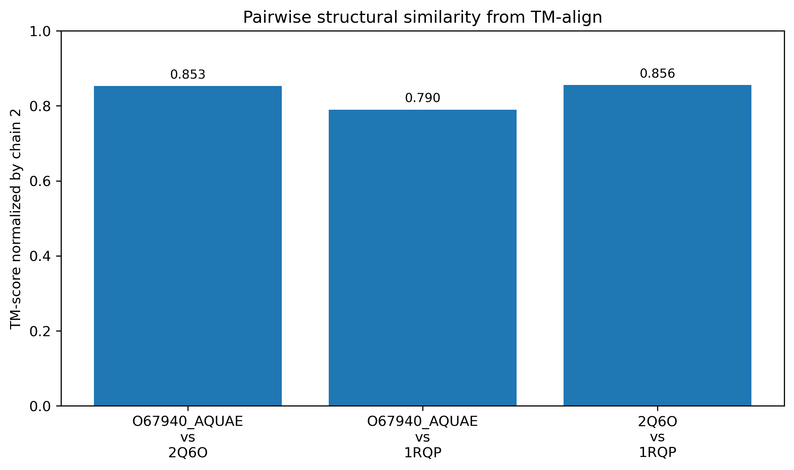
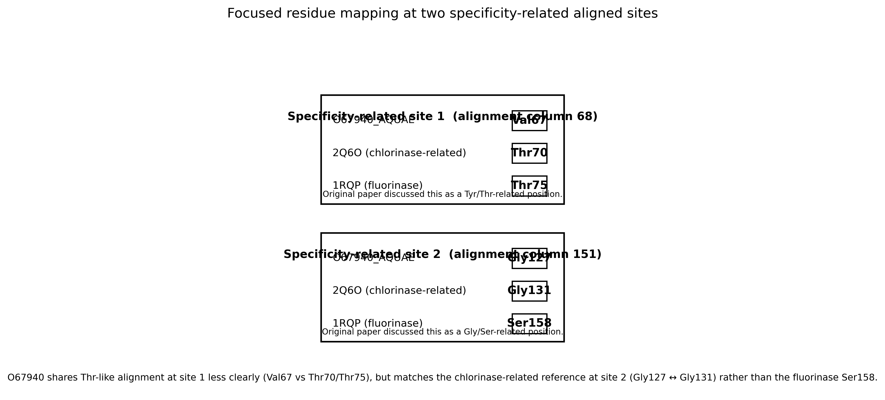

# 1. Introduction

Protein function prediction remains one of the central problems in bioinformatics. Genome sequencing has made protein sequences available at a scale that experimental biology cannot validate one by one, so many proteins enter databases with predicted, partial, or uncertain functional annotations. This gap between available sequence data and experimentally confirmed function has been recognized for decades and remains relevant even as computational methods improve (Friedberg, 2006; Radivojac et al., 2013; Jiang et al., 2016). Public resources such as UniProtKB now organize large amounts of protein sequence and functional information, while structural resources have expanded through both experimentally solved structures and predicted structure databases (UniProt Consortium, 2025; Burley et al., 2021; Varadi et al., 2024). This creates a powerful opportunity for interpretation, but also a risk: a protein may have a known sequence, recognizable domains, and even a confident predicted structure while its exact biochemical function remains unresolved.

The central difficulty is that biological similarity is informative, but not automatically specific. Homologous proteins may share ancestry, folds, domains, or cofactor-binding architectures while differing in substrate specificity, catalytic chemistry, regulatory context, or biological role. This is especially important for enzymes, where broad family membership can suggest a biochemical neighbourhood but still fail to determine exact molecular activity. Work on enzyme superfamilies has shown that related proteins can diversify substantially in function, and studies of public databases have shown that molecular-function misannotation can occur when annotations are transferred too confidently across related proteins (Todd et al., 2001; Valencia, 2005; Schnoes et al., 2009; Holliday et al., 2017). Annotation errors can also propagate through databases when uncertain functional labels are copied from one sequence to another without sufficient evidence (Brenner, 1999; Gilks et al., 2005; Goudey et al., 2022). For that reason, protein annotation is not only a search problem; it is an evidence-calibration problem.

Mazumder and Vasudevan’s *Structure-Guided Comparative Analysis of Proteins* addresses this problem as a methodological case study. Rather than treating protein function prediction as a single database lookup, the paper presents a multi-step workflow that integrates sequence similarity, family/domain classification, structural comparison, phylogenetic context, and functional-residue mapping (Mazumder and Vasudevan, 2008). Their case-study protein, O67940_AQUAE from *Aquifex aeolicus*, is useful because it lies in this difficult middle ground: it shows detectable similarity to characterized SAM-dependent halogenating enzymes, including the chlorinase-related structure 2Q6O and the fluorinase structure 1RQP, but global similarity alone is not enough to support a precise functional assignment.

This project revisits that case study from a modern and reproducible perspective. The aim is not to claim a perfect historical reproduction of every database state and software step used in 2008. Instead, I treat the article as a test case for asking a practical question: which parts of the original evidence chain can still be supported today using current resources, and how far can the interpretation responsibly go? To address this, selected evidence layers were re-analysed using current UniProtKB, InterPro/Pfam, AlphaFoldDB, RCSB PDB, TM-align, MAFFT, and scripted residue-mapping steps (UniProt Consortium, 2025; Blum et al., 2025; Mistry et al., 2021; Jumper et al., 2021; Varadi et al., 2024; Burley et al., 2021; Zhang and Skolnick, 2005; Katoh and Standley, 2013).

A second motivation is reproducibility. Bioinformatics workflows are shaped not only by biological evidence, but also by database versions, file formats, software builds, hidden manual steps, and undocumented failures. These details matter because a result that cannot be traced is difficult to trust, even if the biological conclusion sounds plausible. In this project, downloaded data, scripts, processed outputs, figures, checksums, workflow notes, and runtime corrections were therefore kept as part of the scientific record. This makes the work not only a modern re-analysis of O67940_AQUAE, but also a small reproducibility audit of a published protein-function inference workflow.

# 2. Materials and Methods

## 2.1 Source article and project scope

This project re-analysed selected evidence layers from the protein function inference workflow described by Mazumder and Vasudevan (2008), using O67940_AQUAE as the case-study protein. The original article used O67940_AQUAE to illustrate how sequence comparison, domain/family annotation, structural comparison, phylogenetic context, and functional-residue mapping can be combined to support cautious protein-function prediction.

The aim of this work was not to fully reproduce every historical tool and database step from the original ten-step workflow. Instead, the project was designed as a bounded modern computational re-analysis. The focus was on asking whether current databases and modern structural resources still support the original cautious interpretation of O67940_AQUAE as a SAM-dependent halogenase-related protein, while documenting what was reproduced, what was modernized, and what remained outside scope.

## 2.2 Query protein and data sources

The query protein was O67940_AQUAE, corresponding to UniProt accession O67940 from *Aquifex aeolicus* strain VF5. The current UniProtKB FASTA sequence and full JSON record were retrieved using the UniProt REST API (UniProt Consortium, 2025). The JSON record was parsed to extract entry status, protein name, organism, protein existence level, sequence length, molecular weight, database cross-references, Gene Ontology status, PDB cross-reference status, and UniProt FUNCTION comments.

Domain and family evidence was obtained from current InterPro and Pfam cross-references listed in the UniProtKB record (Blum et al., 2025; Mistry et al., 2021). Metadata for the InterPro and Pfam accessions was retrieved from the EBI InterPro API and summarized into a tabular file. This step was used to translate database accessions into interpretable family/domain labels rather than relying only on accession numbers.

Predicted structural information for O67940_AQUAE was obtained from AlphaFoldDB (Varadi et al., 2024). Instead of assuming a fixed model version manually, the AlphaFoldDB API was queried first to identify the current available file URLs and latest version. The v6 AlphaFoldDB model files were then downloaded, including the PDB, mmCIF, binary CIF, and predicted aligned error files. AlphaFoldDB models are based on the AlphaFold protein-structure prediction method (Jumper et al., 2021).

Experimentally solved reference structures were downloaded from RCSB PDB (Burley et al., 2021). The two reference structures were 2Q6O, used as the chlorinase-related reference, and 1RQP, used as the fluorinase reference. Both PDB and mmCIF formats were downloaded. The PDB files were used for command-line inspection, chain extraction, sequence extraction, and structural comparison.

All downloaded source files, URLs, access dates, local paths, and file purposes were documented in the project provenance files.

## 2.3 Project organization and reproducibility

The project was organized into separate directories for raw data, scripts, results, figures, interpretation notes, metadata, and report drafts. This structure was used to keep raw downloaded records separate from processed outputs and final interpretation.

The main folders were:

- `data/` for downloaded database records and structural files;
- `scripts/` for reusable Python scripts;
- `results/` for processed outputs and summary tables;
- `figures/` for report-ready visual outputs;
- `notes/` for workflow decisions, interpretation notes, and troubleshooting;
- `metadata/` for provenance files, checksums, and project inventory;
- `report/` for draft report sections and planning files.

The computational environment was managed with Conda and exported to `environment.yml`. Key files were tracked with SHA256 checksums. Runtime issues and corrections were documented in `notes/workflow_log.md` and in dedicated notes. This was important because the project was treated not only as a biological re-analysis, but also as a reproducibility audit of a published bioinformatics workflow.

## 2.4 UniProt and InterPro/Pfam annotation analysis

The UniProtKB JSON record was parsed using a Python script to produce a concise summary of the current annotation status of O67940_AQUAE. The script extracted whether the entry was reviewed or unreviewed, whether a curated function comment was present, whether Gene Ontology annotations were available, and whether any experimentally solved PDB structure was cross-referenced.

InterPro and Pfam metadata were then retrieved for the cross-references present in the UniProtKB record. The metadata was summarized into a TSV table containing database name, accession, domain or family name, short name, entry type, and available description. This allowed the domain/family interpretation to be based on current database labels rather than only on the original paper.

## 2.5 AlphaFoldDB model retrieval and confidence analysis

The AlphaFoldDB API was queried for O67940 to avoid assuming an outdated file version (Varadi et al., 2024). An initial attempt to download older v4 files produced invalid tiny files, so the API response was used to identify the current v6 model files. The v6 PDB, mmCIF, binary CIF, and predicted aligned error JSON files were then downloaded.

Local model confidence was assessed using pLDDT values stored in the B-factor column of the AlphaFold PDB file. A Python script extracted one pLDDT value per residue and summarized the mean, median, minimum, maximum, and confidence-range counts.

Predicted aligned error was analysed to estimate uncertainty in relative residue positioning. UniProt-derived domain boundaries were used to summarize PAE within the N-terminal SAM_HAT domain, within the C-terminal SAM_HAT domain, and between the two domains. This was used only as predicted structural-confidence evidence, not as proof of biochemical activity.

## 2.6 Reference structure retrieval, inspection, and chain extraction

The reference structures 2Q6O and 1RQP were downloaded from RCSB PDB in both PDB and mmCIF formats. File sizes and ATOM record counts were checked to ensure the downloaded files were valid structural files rather than incomplete downloads or error pages.

The PDB files were inspected to summarize chain content and heteroatom content. Chain A was selected from each reference structure for controlled one-chain comparison. Chain A was also extracted from the O67940_AQUAE AlphaFoldDB model. This produced three comparable chain-level PDB files: O67940_AQUAE AlphaFold chain A, 2Q6O chain A, and 1RQP chain A.

The chain-only approach simplified structural comparison and residue mapping. However, this is also a limitation because ligand binding, oligomeric context, and interface-level effects may not be fully represented by a single-chain comparison.

## 2.7 Structural comparison with TM-align

Pairwise structural comparisons were performed using TM-align (Zhang and Skolnick, 2005). The comparisons were:

1. O67940_AQUAE AlphaFold chain A versus 2Q6O chain A;
2. O67940_AQUAE AlphaFold chain A versus 1RQP chain A;
3. 2Q6O chain A versus 1RQP chain A.

For each comparison, the raw TM-align output was saved, and a summary table was generated containing chain lengths, aligned length, RMSD, sequence identity over aligned residues, and TM-scores normalized by each chain length.

A newer TM-align build initially failed during real structural alignment with an illegal-instruction runtime error. The input PDB files had already been checked and contained valid ATOM records, so this was treated as a likely binary/runtime compatibility issue rather than a biological-data problem. An older Bioconda TM-align build was installed and used successfully. This correction was documented as part of the reproducibility audit.

## 2.8 Sequence alignment with MAFFT

The extracted chain A sequences from O67940_AQUAE, 2Q6O, and 1RQP were aligned using MAFFT with the `--auto` option (Katoh and Standley, 2013). The purpose of this alignment was not to build a full phylogeny, but to create a controlled alignment for residue mapping across the query and the two reference structures.

A Python script summarized the alignment length, gap counts, ungapped sequence lengths, and pairwise sequence identities excluding gap-containing columns. This allowed global sequence similarity to be compared with the structural comparison results.

## 2.9 Functional-residue mapping

Functional residues discussed in the original paper were mapped onto the MAFFT alignment. A custom Python script connected three coordinate systems: PDB residue numbers, ungapped sequence positions, and alignment columns. This allowed residues from 2Q6O and 1RQP to be mapped to corresponding aligned residues in O67940_AQUAE.

A full residue-mapping table was first generated for audit purposes. A focused summary table was then created for the most biologically relevant positions, especially the Val67/Gly127 mapping in O67940_AQUAE. The mapping was interpreted cautiously because it depends on the MAFFT alignment and current PDB residue numbering.

During this step, some C-terminal residues listed for 2Q6O in the original paper did not match the current downloaded coordinate file directly. These discrepancies were verified by direct PDB inspection and kept as limitations rather than ignored.

## 2.10 Evidence integration and figure generation

The main results were integrated into an evidence table separating: the observed result, what it supports, what it does not prove, and the remaining limitation. This table was used to control interpretation and avoid overclaiming.

Report figures were generated from the reproducible outputs. These included a workflow/evidence-chain figure, an AlphaFold pLDDT confidence plot with domain boundaries, a TM-align structural-comparison plot, and a focused residue-mapping figure.

The final interpretation was based on integration of multiple evidence layers rather than on any single tool. Structural similarity, domain annotation, and residue mapping were treated as computational support for a functional hypothesis, not as experimental validation of enzyme activity.

# 3. Results

## 3.1 O67940_AQUAE remains unresolved in current curated annotation

The first result addressed a basic but important question: has O67940_AQUAE become experimentally characterized since the original study, or does the biological problem still remain? The parsed UniProtKB record showed that O67940_AQUAE remains an unreviewed TrEMBL entry and is still named “Uncharacterized protein.” No UniProt FUNCTION comment, Gene Ontology annotation, or PDB cross-reference was found in the parsed record. The protein existence level was PE=3, meaning that the protein is inferred from homology rather than direct protein-level evidence.

These results are summarized in Table 1 and are available in the generated output file `results/uniprot_O67940_record_summary.txt`.

| Field | Result |
|---|---|
| UniProt accession | O67940 |
| Entry name | O67940_AQUAE |
| Entry type | UniProtKB unreviewed / TrEMBL |
| Protein name | Uncharacterized protein |
| Organism | *Aquifex aeolicus* strain VF5 |
| Protein existence | PE=3, inferred from homology |
| Sequence length | 251 amino acids |
| UniProt FUNCTION comment | None found |
| GO annotation | None found |
| PDB cross-reference | None found |
| Modern cross-references | InterPro, Pfam, eggNOG, KEGG, AlphaFoldDB |

**Table 1.** Current UniProtKB annotation status of O67940_AQUAE.

This result matters because it shows that the original problem has not disappeared. O67940_AQUAE is not simply a historical “unknown protein” that has since received a reviewed curated function. It remains unresolved at the curated annotation level, which justifies revisiting the original structure-guided function-inference workflow using current resources (Mazumder and Vasudevan, 2008; UniProt Consortium, 2025).

## 3.2 Current InterPro/Pfam evidence supports a SAM-related family/domain context

The current UniProtKB record was not empty: it contained modern computational cross-references. InterPro and Pfam metadata showed that O67940_AQUAE is associated with N-terminal and C-terminal SAM_HAT domains and with the S-adenosyl-L-methionine hydroxide adenosyltransferase family/domain context. The full output is available in `results/O67940_interpro_pfam_metadata.tsv`.

| Database | Accession | Name / short name | Type |
|---|---|---|---|
| InterPro | IPR046469 | SAM_HAT_N | Domain |
| InterPro | IPR046470 | SAM_HAT_C | Domain |
| InterPro | IPR002747 | SAM_OH_AdoTrfase | Family |
| Pfam | PF01887 | SAM_HAT_N | Domain |
| Pfam | PF20257 | SAM_HAT_C | Domain |

**Table 2.** Main InterPro/Pfam evidence for O67940_AQUAE.

This result adds an important layer of interpretation. O67940_AQUAE is not a completely isolated unknown sequence; it sits inside a recognizable SAM-related family/domain context. However, this evidence remains broad. Family and domain labels can support a general biochemical context, but they do not by themselves distinguish chlorinase, fluorinase, or another halogenase-related activity. For that reason, the InterPro/Pfam result was treated as family-level support, not as direct proof of exact substrate specificity (Blum et al., 2025; Mistry et al., 2021).

## 3.3 AlphaFoldDB provides a high-confidence predicted structural model

The AlphaFoldDB v6 model was analysed to determine whether the predicted structure was suitable for modern structural comparison. The model contained 251 residues. The mean pLDDT was 96.70, the median pLDDT was 97.69, and no residue had pLDDT below 70. Most residues were in the very high confidence range. The complete summary is available in `results/alphafold/O67940_alphafold_plddt_summary.txt`.

| AlphaFold confidence metric | Value |
|---|---:|
| Number of residues | 251 |
| Mean pLDDT | 96.70 |
| Median pLDDT | 97.69 |
| Minimum pLDDT | 77.56 |
| Maximum pLDDT | 98.88 |
| Residues with pLDDT ≥ 90 | 242 |
| Residues with pLDDT 70–90 | 9 |
| Residues with pLDDT < 70 | 0 |

**Table 3.** AlphaFoldDB local confidence summary for O67940_AQUAE.

The domain-level PAE analysis also supported structural inspection. Using UniProt-derived domain boundaries, the internal mean PAE was 2.33 Å for the N-terminal SAM_HAT domain and 1.83 Å for the C-terminal SAM_HAT domain. The mean PAE between the two domains was 4.03 Å. The output is available in `results/alphafold/O67940_alphafold_pae_by_domain_summary.txt`.

| Region compared | Mean PAE (Å) | Interpretation |
|---|---:|---|
| N-terminal SAM_HAT domain internal | 2.33 | Low predicted internal uncertainty |
| C-terminal SAM_HAT domain internal | 1.83 | Low predicted internal uncertainty |
| Between N-terminal and C-terminal domains | 4.03 | Moderate but still relatively low predicted inter-domain uncertainty |

**Table 4.** Domain-level AlphaFold predicted aligned error summary.

Together, the pLDDT and PAE results support using the AlphaFoldDB model as a modern structural evidence layer. This does not mean AlphaFold proves biochemical function. It only means the predicted model appears suitable for structural inspection and comparison in this computational re-analysis (Jumper et al., 2021; Varadi et al., 2024).

**Figure 2.** AlphaFoldDB v6 pLDDT profile for O67940_AQUAE, with UniProt-derived domain boundaries marked.

## 3.4 Structural comparison shows strong fold-level similarity to both reference enzymes

The experimentally solved reference structures 2Q6O and 1RQP were retrieved from RCSB PDB and chain A was extracted from each structure. O67940_AQUAE AlphaFold chain A was then compared with both references using TM-align. The full summary is available in `results/structure_comparison/tmalign_pairwise_summary.tsv`.

| Comparison | Aligned length | RMSD (Å) | Sequence identity over aligned residues | TM-score normalized by reference |
|---|---:|---:|---:|---:|
| O67940_AQUAE vs 2Q6O | 250 | 2.01 | 0.288 | 0.85311 |
| O67940_AQUAE vs 1RQP | 250 | 2.01 | 0.268 | 0.78998 |
| 2Q6O vs 1RQP | 267 | 1.89 | 0.378 | 0.85589 |

**Table 5.** Pairwise TM-align structural comparison summary.

The result shows that O67940_AQUAE is globally structurally similar to both experimentally characterized references. The reference-normalized TM-score was higher against 2Q6O than against 1RQP, suggesting a modest structural preference toward the chlorinase-related reference. However, this must be interpreted carefully. A high fold-level similarity supports structural relatedness, but it does not by itself prove identical enzymatic function or substrate specificity (Zhang and Skolnick, 2005).

**Figure 3.** TM-align structural-comparison summary.

## 3.5 Global sequence identity does not resolve specificity

The MAFFT alignment provided a sequence-level comparison between O67940_AQUAE, 2Q6O chain A, and 1RQP chain A. The output is available in `results/sequence_alignment/O67940_2Q6O_1RQP_alignment_summary.tsv`.

| Pairwise comparison | Identical positions | Compared positions | Identity excluding gap columns |
|---|---:|---:|---:|
| O67940_AQUAE vs 2Q6O | 74 | 249 | 0.2972 |
| O67940_AQUAE vs 1RQP | 74 | 250 | 0.2960 |
| 2Q6O vs 1RQP | 105 | 267 | 0.3933 |

**Table 6.** MAFFT pairwise sequence identity summary.

This result is one of the clearest examples of why direct annotation transfer would be risky. O67940_AQUAE is almost equally similar to 2Q6O and 1RQP at the global sequence level. The difference between 0.2972 and 0.2960 is too small to justify assigning precise function from global sequence identity alone. This supports the original paper’s logic: when global similarity is informative but not decisive, interpretation must move toward structural context and functional-residue analysis (Mazumder and Vasudevan, 2008; Katoh and Standley, 2013).

## 3.6 Functional-residue mapping provides the strongest local evidence

The strongest functional clue came from residue mapping. The full mapping is available in `results/residue_mapping/functional_residue_mapping_mafft.tsv`, and the focused report-level summary is available in `results/residue_mapping/focused_functional_residue_summary.tsv`.

| Focused site | O67940_AQUAE | 2Q6O | 1RQP | Interpretation |
|---|---:|---:|---:|---|
| Tyr/Thr-related site | Val67 | Thr70 | Thr75 | O67940 does not directly match the fluorinase Thr pattern |
| Gly/Ser-related site | Gly127 | Gly131 | Ser158 | O67940 matches the 2Q6O Gly pattern rather than 1RQP Ser158 |
| C-terminal caution | Val229 | Leu250 | Arg277 | Original 2Q6O Arg250 did not match current direct coordinate numbering |
| C-terminal caution | Val231 | Gln252 | Ala279 | Original 2Q6O Glu252 did not match current direct coordinate numbering |

**Table 7.** Focused functional-residue mapping summary.

The key result is the Gly127 position. O67940_AQUAE Gly127 aligns with 2Q6O Gly131 rather than 1RQP Ser158. This supports the original cautious interpretation that O67940_AQUAE should not be assigned direct fluorinase-specific function based on broad similarity alone.

The Val67 position is also informative, but more nuanced. In the current downloaded 2Q6O coordinate file, residue 70 is Thr rather than Tyr, consistent with the Tyr70Thr mutation context discussed in the original paper. This was not treated as an error in the workflow. Instead, it was documented as a construct/mutation context that must be considered during residue interpretation.

The two C-terminal cautions are also important. The original paper listed 2Q6O Arg250 and Glu252, but direct inspection of the downloaded 2Q6O chain A coordinate file showed Leu250 and Gln252. This means the full residue table should not be described as perfectly reproduced. The key Val67/Gly127 mapping is supported, but some residue-numbering or construct-level differences remain.

**Figure 4.** Focused residue mapping at the two specificity-related aligned sites.

## 3.7 Integrated evidence supports cautious annotation transfer, not experimental proof

The final evidence integration table is available in `results/evidence_integration/evidence_integration_table_short.tsv`. It was used to separate what each evidence layer supports from what it does not prove.

| Evidence layer | Main result | Interpretation | Main limitation |
|---|---|---|---|
| UniProtKB status | Entry remains unreviewed and uncharacterized | Original problem remains relevant | Database status is not biochemical evidence |
| InterPro/Pfam | SAM_HAT domains and SAM-related family context | Supports broad family/domain membership | Does not resolve exact specificity |
| AlphaFoldDB | High pLDDT and low domain-level PAE | Supports structural inspection | Predicted structure is not experimental validation |
| TM-align | Strong fold similarity to both references, higher against 2Q6O | Supports relatedness and modest 2Q6O preference | Fold similarity does not prove function |
| MAFFT | O67940 identity nearly tied to 2Q6O and 1RQP | Sequence identity alone is not decisive | No full phylogeny performed |
| Residue mapping | Val67/Gly127 mapping reproduced | Strongest support for cautious non-fluorinase-specific interpretation | Some C-terminal residue discrepancies remain |

**Table 8.** Integrated evidence summary.

Taken together, the results support a SAM-dependent halogenase-related interpretation for O67940_AQUAE, with evidence leaning closer to the chlorinase-related reference than to direct fluorinase-specific assignment. The most important point is not that one tool “solved” the protein. The interpretation comes from the convergence of database status, domain evidence, predicted-structure confidence, structural comparison, sequence alignment, and residue-level mapping.

This remains computational evidence. It supports a functional hypothesis, but it does not experimentally validate enzyme activity or exact substrate specificity.

# 4. Discussion

This modern re-analysis supports the broad direction of Mazumder and Vasudevan’s original interpretation, but it also reinforces why the authors were cautious. The main result is not that one database or one alignment “solved” O67940_AQUAE. Rather, the evidence becomes meaningful only when the layers are read together: the protein remains uncharacterized in the current UniProtKB record, InterPro/Pfam places it in a SAM-related family/domain context, AlphaFoldDB provides a high-confidence predicted structural model, TM-align shows strong fold-level similarity to both reference structures, MAFFT shows nearly tied sequence identity to 2Q6O and 1RQP, and focused residue mapping provides the strongest local support for a halogenase-related interpretation that is closer to the chlorinase-related reference than to direct fluorinase-specific assignment (Mazumder and Vasudevan, 2008).

The most important biological point is that the annotation should stay at the level supported by the evidence. O67940_AQUAE can reasonably be discussed as a SAM-dependent halogenase-related protein, but this workflow does not experimentally prove that it is a chlorinase, and it does not prove exact substrate specificity. This distinction matters because function is not a single label. A protein may share a family, fold, or cofactor-binding architecture with characterized enzymes while differing in substrate preference, catalytic details, or biological role. This is consistent with broader work showing that enzyme superfamilies can contain substantial functional diversity and that molecular-function misannotation can occur when broad relatedness is treated as equivalent to precise function (Todd et al., 2001; Schnoes et al., 2009).

Compared with the original workflow, the main gain of this re-analysis is modernization and reproducibility. The original paper depended on databases and tools available in 2008, and the authors explicitly noted that their analysis reflected the database state at the time. In this project, the same biological question was revisited using current UniProtKB, InterPro/Pfam, AlphaFoldDB, RCSB PDB, TM-align, and MAFFT resources. The AlphaFoldDB model added a structural layer that was not available for O67940_AQUAE in the original study. At the same time, this modernization is not the same as perfect reproduction. Using AlphaFoldDB and TM-align changes the workflow compared with the original SCOP/VAST/structure-guided alignment context, so the project should be described as a bounded modern re-analysis rather than a one-to-one historical recreation.

The workflow also exposed real reproducibility issues. The initial AlphaFold version assumption produced invalid tiny files, and the correct files were only obtained after querying the AlphaFoldDB API. TM-align also produced a runtime compatibility problem before a working Bioconda build was used. These were not biological results, but they are still scientifically relevant because computational bioinformatics depends on software versions, database versions, executable compatibility, and data provenance. If such issues are hidden, the analysis becomes difficult to audit. In this project, they were documented as part of the workflow rather than treated as embarrassing side notes.

The main unresolved limitation is that this remains a computational analysis. No biochemical validation was performed. A true experimental validation would require expressing and purifying O67940_AQUAE, testing activity with SAM and different halide ions, and detecting products using biochemical or analytical chemistry methods. Without such experiments, the final interpretation must remain a functional hypothesis. A second limitation is that no full homolog phylogenetic reconstruction was performed. The original paper used broader homolog analysis and phylogenetic context to avoid direct annotation transfer from a single hit. Here, the analysis focused instead on current annotation, domain/family evidence, structural comparison, sequence alignment, and focused residue mapping. This was a deliberate scope decision, but it means the project cannot claim to reproduce the full evolutionary analysis of the original workflow.

Another important limitation is residue numbering and construct context. The key Val67/Gly127 mapping was supported, but two C-terminal 2Q6O residues listed in the original paper did not match the current downloaded coordinate numbering directly. This does not invalidate the main local residue result, but it does mean that the original residue table should be described as partially reproduced, not perfectly reproduced. This is a useful reminder that structural bioinformatics is not only about downloading a PDB file; construct differences, mutations, chain selection, numbering, ligands, and alignment choices can all affect interpretation.

Overall, the project shows why transparent computational workflows matter in bioinformatics. Protein-function prediction is powerful, but it is also vulnerable to overconfident annotation transfer. Incorrect annotations can enter public databases and propagate through similarity-based workflows, especially when provenance is weak or functional labels are copied at a more specific level than the evidence supports (Brenner, 1999; Goudey et al., 2022). The strongest conclusion here is therefore deliberately cautious: current computational evidence supports a SAM-dependent halogenase-related interpretation for O67940_AQUAE, with evidence leaning closer to the chlorinase-related reference than to direct fluorinase-specific assignment. Exact biochemical specificity remains experimentally unresolved.

# 5. References

Mazumder R, Vasudevan S. 2008. Structure-guided comparative analysis of proteins: principles, tools, and applications for predicting function. *PLoS Computational Biology* 4(9):e1000151. https://doi.org/10.1371/journal.pcbi.1000151

The UniProt Consortium. 2025. UniProt: the Universal Protein Knowledgebase in 2025. *Nucleic Acids Research* 53(D1):D609–D617.

Blum M, et al. 2025. InterPro: the protein sequence classification resource in 2025. *Nucleic Acids Research* 53(D1):D444–D456.

Mistry J, Chuguransky S, Williams L, Qureshi M, Salazar GA, Sonnhammer ELL, Tosatto SCE, Paladin L, Raj S, Richardson LJ, Finn RD, Bateman A. 2021. Pfam: The protein families database in 2021. *Nucleic Acids Research* 49(D1):D412–D419.

Varadi M, et al. 2024. AlphaFold Protein Structure Database in 2024. *Nucleic Acids Research* 52(D1):D368–D375.

Jumper J, Evans R, Pritzel A, Green T, Figurnov M, Ronneberger O, et al. 2021. Highly accurate protein structure prediction with AlphaFold. *Nature* 596:583–589.

Burley SK, et al. 2021. RCSB Protein Data Bank: powerful new tools for exploring 3D structures of biological macromolecules for basic and applied research and education. *Nucleic Acids Research* 49(D1):D437–D451.

Zhang Y, Skolnick J. 2005. TM-align: a protein structure alignment algorithm based on the TM-score. *Nucleic Acids Research* 33(7):2302–2309.

Katoh K, Standley DM. 2013. MAFFT multiple sequence alignment software version 7: improvements in performance and usability. *Molecular Biology and Evolution* 30(4):772–780.

Todd AE, Orengo CA, Thornton JM. 2001. Evolution of function in protein superfamilies, from a structural perspective. *Journal of Molecular Biology* 307(4):1113–1143.

Brenner SE. 1999. Errors in genome annotation. *Trends in Genetics* 15(4):132–133.

Schnoes AM, Brown SD, Dodevski I, Babbitt PC. 2009. Annotation error in public databases: misannotation of molecular function in enzyme superfamilies. *PLoS Computational Biology* 5(12):e1000605. https://doi.org/10.1371/journal.pcbi.1000605

Goudey B, et al. 2022. Propagation, detection and correction of errors using the sequence database network. *Briefings in Bioinformatics* 23(6):bbac416.

Friedberg I. 2006. Automated protein function prediction—the genomic challenge. *Briefings in Bioinformatics* 7(3):225–242.

Radivojac P, Clark WT, Oron TR, Schnoes AM, Wittkop T, Sokolov A, et al. 2013. A large-scale evaluation of computational protein function prediction. *Nature Methods* 10(3):221–227.

Jiang Y, Oron TR, Clark WT, Bankapur AR, D’Andrea D, Lepore R, et al. 2016. An expanded evaluation of protein function prediction methods shows an improvement in accuracy. *Genome Biology* 17:184.

Valencia A. 2005. Automatic annotation of protein function. *Current Opinion in Structural Biology* 15(3):267–274.

Gilks WR, Audit B, de Angelis D, Tsoka S, Ouzounis CA. 2005. Percolation of annotation errors through hierarchically structured protein sequence databases. *Mathematical Biosciences* 193(2):223–234.

Holliday GL, Andreini C, Fischer JD, Rahman SA, Almonacid DE, Williams ST, Pearson WR. 2017. MACiE: exploring the diversity of biochemical reactions. *Nucleic Acids Research* 45(D1):D515–D520.
